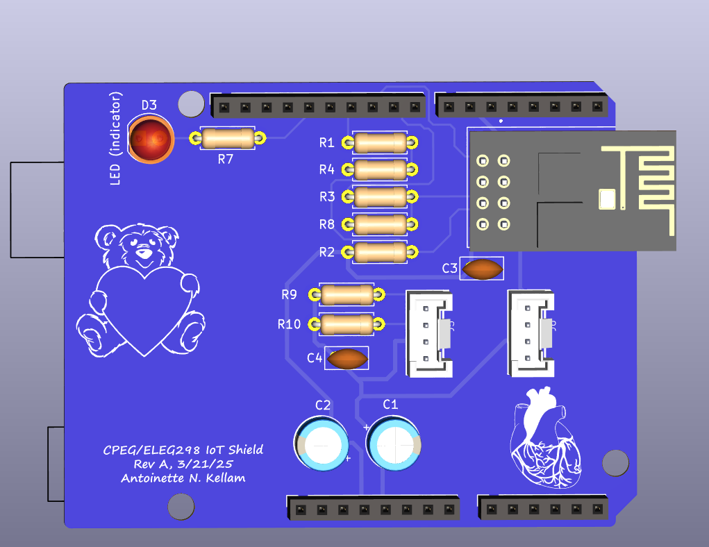

# PulseSync IoT Device

PulseSync IoT is a real-time heart-rate monitoring system that integrates embedded firmware, custom PCB hardware, and IoT connectivity. The system detects heartbeats using a Grove ear-clip sensor (PPG-based), synchronizes an onboard LED with each detected beat, and transmits heart-rate data wirelessly using an ESP8266 Wi-Fi module.



*KiCad-generated 3D render of the finalized PCB layout for visual reference and board geometry.*
---

## Project Overview

- **Heart-rate sensing:** Grove ear-clip sensor using photoplethysmography (PPG)
- **Microcontroller:** Arduino Uno
- **Wireless communication:** ESP-01S (ESP8266)
- **Visual feedback:** Onboard LED synchronized to detected heartbeats
- **PCB design:** Custom Arduino Uno–compatible shield designed in KiCad

This project was developed as part of **CPEG/ELEG298** and demonstrates foundational skills in embedded systems, PCB design, sensor interfacing, and IoT-based data transmission.

---
## Repository Structure

```text
PulseSync-IoT-Device/
├── README.md              # Main project overview
├── LICENSE
├── firmware/              # Embedded Arduino (C/C++) firmware
│   └── README.md
├── hardware/              # PCB design and fabrication files
│   ├── README.md
│   ├── kicad/             # KiCad schematic & PCB source (if available)
│   ├── fabrication/       # Manufacturing-ready files
│   │   ├── gerbers/       # Gerber layer files
│   │   └── drill/         # Excellon drill files and drill maps
│   └── outputs/           # BOM, schematic PDFs, rendered PCB views
├── images/                # PCB renders and placement visuals
│   ├── README.md
│   ├── renders/           # KiCad 3D board renders
│   ├── TOP_placement_BOM_overlay.png
│   └── BOTTOM_placement_BOM_overlay.png
└── docs/                  # Final report and presentation slides
    ├── README.md
    ├── report/
    └── slides/

