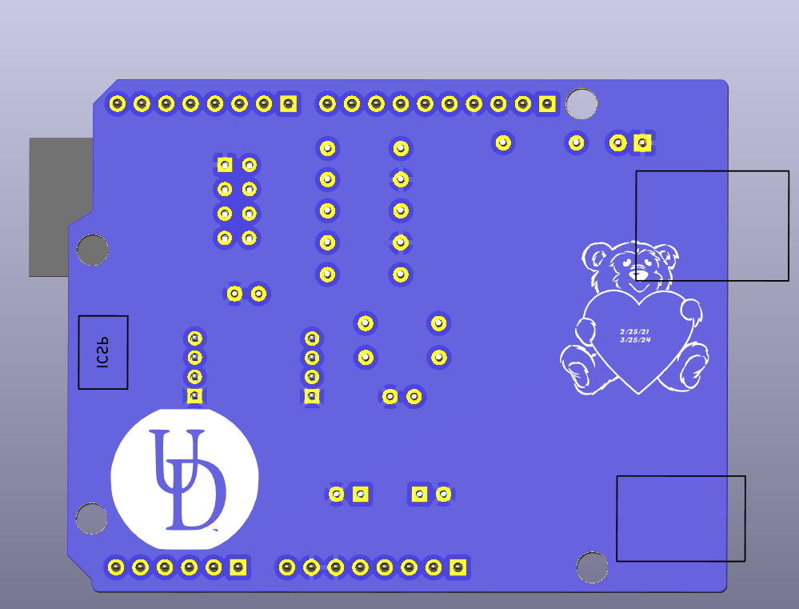

---
## PCB Layout and Component Placement Files

### Top Layer – Component Placement (with BOM Overlay)

### Bottom Layer – Component Placement (with BOM Overlay)

## KiCad 3D Renders

### Top View

### Bottom View

These renders were generated using KiCad’s 3D Viewer and are provided for visual reference of component placement and board geometry.
